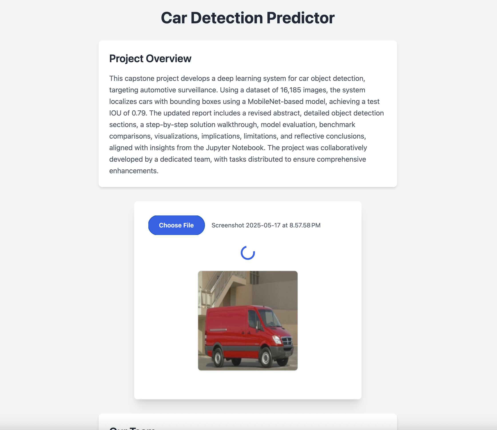

# Car Detection Project

A web-based application for car classification and object detection, built for the Capstone Project: Computer Vision.

## Folder Structure
- `backend/`: Flask API and models
  - `app.py`: Flask server
  - `fine_tuned_mobilenetv2.h5`: Classification model
  - `mobilenet_bbox_model.h5`: Object detection model
  - `class_names.json`: Class ID to name mapping
  - `requirements.txt`: Backend dependencies
- `frontend/`: React frontend
  - `index.html`: Single-page HTML with React and Tailwind
- `README.md`: This file

## Setup Instructions
### Backend
1. Navigate to `backend/`:

   ```bash
   cd backend

2. Create a virtual environment and activate it:

   ```bash
   python -m venv venv
   source venv/bin/activate  # Linux/Mac
   venv\Scripts\activate  # Windows

3. Install dependencies:

   ```bash
   pip install -r requirements.txt

4. Ensure `fine_tuned_mobilenetv2.h5`, `mobilenet_bbox_model.h5`, and `class_names.json` are in `backend/`.

5. Run the Flask server

   ```bash
   python app.py

  The API will be available at http://localhost:5000.

### Frontend
1. Navigate to `frontend/`:

   ```bash
   cd frontend

2. Open index.html in a browser (e.g., via a local server or directly):

   ```bash
   python -m http.server 8000

    Access at `http://localhost:8000`.

3. Ensure the backend is running to handle API requests.


## Deployment to Render Production

The application is deployed on Render as a Web Service, hosting both the Flask API and static frontend.

### Prerequisites
- Render account
- GitHub repository with the project

### Steps
1. **Push to GitHub**:
   ```bash
   cd car-detection-project
   git init
   git add .
   git commit -m "Initial commit"
   git remote add origin https://github.com/your-username/car-detection-project.git
   git push origin main
   ```
   - If models exceeds 100MB, use Git LFS:
     ```bash
     git lfs install
     git lfs track "*.h5"
     git add .gitattributes backend/mobilenet_bbox_model.h5
     ...
     git commit -m "Add model with LFS"
     git push origin main
     ```

2. **Create Render Web Service**:
   - Log in to [render.com](https://render.com).
   - New > Web Service > Connect your GitHub repository.
   - Configure:
     - **Runtime**: Python
     - **Build Command**: `pip install -r backend/requirements.txt`
     - **Start Command**: `gunicorn backend.app:app --bind 0.0.0.0:$PORT`
     - **Root Directory**: Leave blank
   - Deploy the service.

3. **Test Deployment**:
   - Access the Render URL (`https://car-detection-project.onrender.com`).
   - Verify:
     - Frontend loads with Heading, Project Description, File Upload, and Team Members.
     - Image upload displays a red bounding box and coordinates.
     - Mailbox icons toggle emails.

## Images
Screenshots and visualizations enhance the project documentation. Images are stored in the `backend/` folder.

### Example Screenshots
- **Frontend Interface**:
  
  *The main interface with file upload and the team members section.*

- **Bounding Box Output**:
  
  *Sample output showing a car with a red bounding box and coordinates.*

- **Full Page Output**:
  
